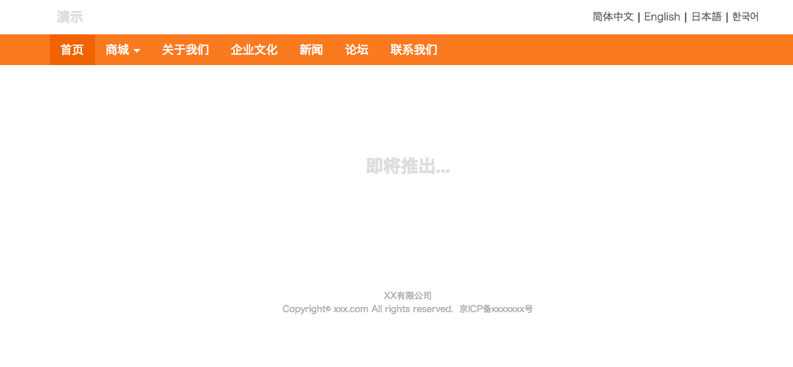
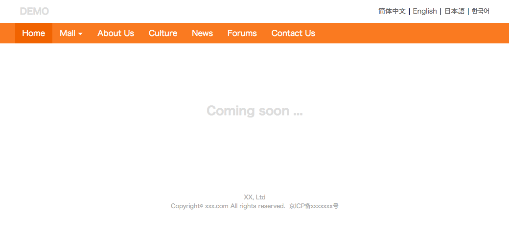
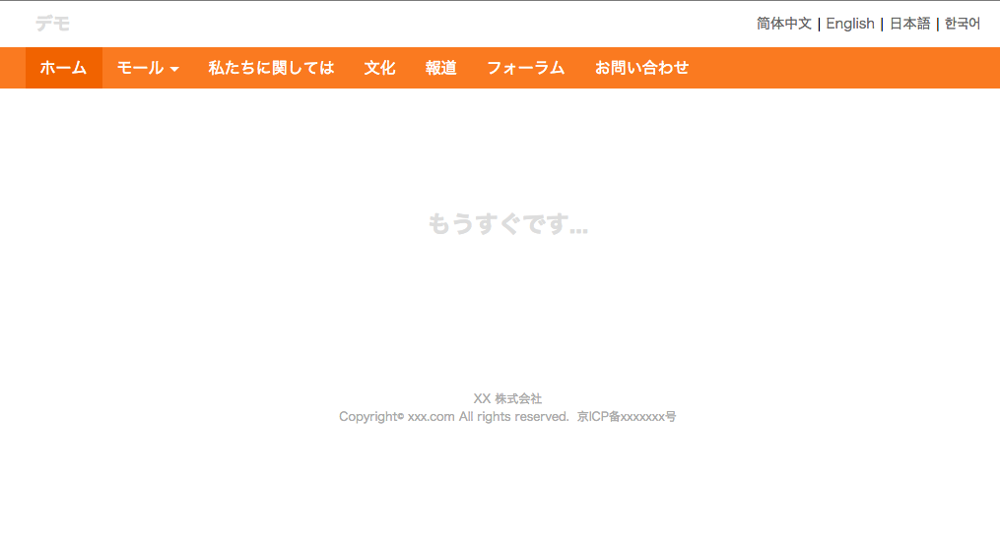
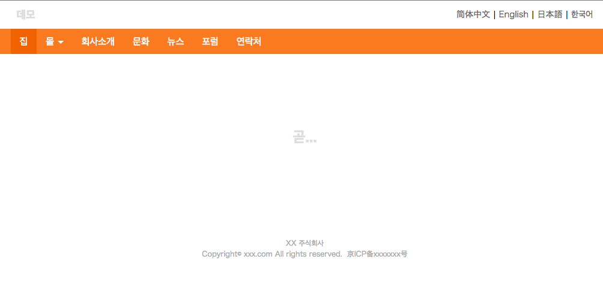

# dev-i18n-web
Using swig to develop international website

[Multi-language translation](http://www.nicetranslator.com/)

## 环境

```
安装 node npm
安装 ruby
```


## DEMO

Chinese 简体中文



English English



Japanese 日本語



Korean 한국어



## Add more languages, Such as zh-TW

`lib/html/**/*.tpl` are for Large chunks of text.

`lib/json/*.json`  are for tinytext.

+ make JSON File

```
mkdir lib/json/zh-tw.json
```

+ add `"tw": "繁體中文"` to `langName` and  `"tw": "../zh-t/index.html"` to `langUrl` in each language JSON file

```
  "langName": {
    "en": "English",
    "zh": "简体中文",
    "jp": "日本語",
    "ko": "한국어",
    "tw": "繁體中文"
  },
  "langUrl": {
    "zh": "../zh-cn/index.html",
    "en": "../en-us/index.html",
    "jp": "../jp/index.html",
    "ko": "../korea/index.html",
    "tw": "../zh-tw/index.html"
  },
```

+ Translate JSON data into traditional Stadium Chinese(繁體中文)

+ Translate `lib/html/**/*.tpl` to `lib/html/zh-t/*.tpl`

+ `gulpfile.js`

```
var output = {
  ...,
  tw: path.join(outputDir, 'zh-tw')
}
gulp.task('twTmp', function() {
  return gulp.src(source.htmlFileDir)
    .pipe(data(getJsonData('tw')))
    .pipe(swig())
    .pipe(gulp.dest(output.tw));
});

gulp.task('build', [
  ...,
  twTmp
]);
```

+ `_header.tpl` 

```
  <span class="divider">|</span>
  <a class="lang-ko-a" href="{{langUrl.tw}}">{{langName.tw}}</a>
```

+ END (you can change for your website)
